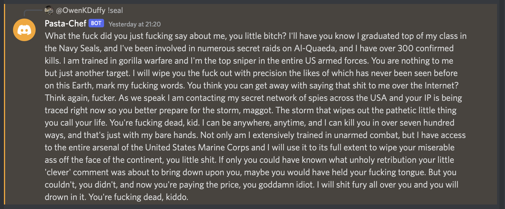

# A Simple Discord bot for Sending Copy Pasta Memes

## How to Use
Use `!<command>` to trigger the bot to reply with the referenced copypasta

Define commands and the related pastas in the pastas.json file.

## Example

## See the current commands
[Commands](pastas.json)

